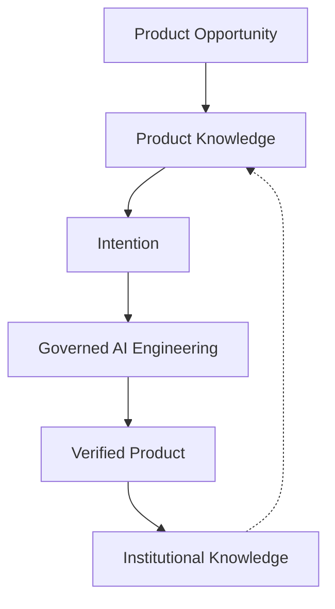

# Orivus AI Product Framework

**An Experimental Open Standard for AI-Native Product Engineering**

| Version | 0.1 |
| Status | Experimental — Frozen |
| License | [Apache License 2.0](LICENSE) |

---

## The Problem

AI can generate code faster than ever.

It cannot preserve product knowledge, architectural integrity, or long-term maintainability by itself.

Most AI-assisted workflows follow:

```
Problem → Prompt → Generated Code
```

That pattern optimizes code generation. It does not optimize product evolution.

Over time, software built this way accumulates architectural drift, duplicated implementations, obsolete documentation, and product knowledge trapped in conversations instead of becoming institutional knowledge.

The engineering question is no longer *how to generate software*. It is *how to build products when a significant share of engineering execution is performed by AI*.

---

## The Idea

Orivus AI Product Framework is an open engineering standard for building AI-native software products.

It defines how humans and AI agents collaborate to deliver software without losing the knowledge that makes future evolution possible.

The standard is technology-independent, vendor-independent, and product-independent. It does not prescribe languages, tools, AI models, or repository layouts.

---

## One Sentence

```
Humans govern products.
Product Knowledge governs implementation.
AI executes engineering.
```

When the executor changes, the knowledge remains. When the model improves, the architecture remains. When the session ends, the decisions remain.

---

## The Flow



A product opportunity becomes governed **Product Knowledge**. Knowledge is delivered through an **Intention** — the smallest governed unit of product change. AI executes that Intention under governance, produces a **verified product**, and every completed Intention leaves behind **institutional knowledge** that strengthens the next one.

---

## Why Code Generation Is Not Enough

Generating code faster does not preserve a product. `Problem → Prompt → Code` optimizes output, not evolution. At scale it produces:

- architectural drift, because nothing enforces the architecture;
- knowledge trapped in chat history instead of the product;
- no governance boundary between what AI may decide and what humans decide;
- completion claimed by confidence, not by evidence.

The standard replaces prediction-driven engineering with knowledge-driven engineering.

## Why You Need This

If a meaningful share of your engineering is executed by AI, your most durable asset is no longer the code — it is the **Product Knowledge** that lets the product keep evolving after the session, the model, or the tool changes. This standard makes that knowledge governable, verifiable, and portable.

---

## What This Is

A specification for knowledge-driven, governed, evidence-based product engineering in the age of AI.

It defines:

- how Product Knowledge governs implementation;
- how engineering execution is validated before it progresses;
- how products evolve through governed Intentions rather than unstructured prompts;
- how verified knowledge is preserved across sessions, tools, and teams.

## What This Is Not

- A prompt library
- A coding agent
- An IDE plugin
- A methodology for a specific company or product
- A replacement for architecture, testing, or domain design

Reference implementations exist to validate the standard in practice. They are maintained independently and are not part of this specification.

---

## How It Works

```
Product Knowledge
        ↓
Governed Engineering
        ↓
Verified Product Evolution
```

Every meaningful product change follows the same lifecycle:

```
Intention → Planning → Implementation → Validation → Audit → Human Review → Closed
```

Engineering execution is atomic at the milestone level:

```
LOCK → IMPLEMENT → VERIFY → AUDIT → PASS → UPDATE PLAN → NEXT
```

The standard evolves only through evidence from real product implementations — not through theoretical additions.

---

## Who This Is For

- Software architects evaluating governed AI-assisted development
- Engineering leaders responsible for product integrity at scale
- Teams building AI-native products that must remain maintainable over years
- Researchers studying human–AI engineering collaboration
- Builders of reference implementations willing to contribute evidence

You do not need a specific product, vendor, IDE, or AI model to adopt this standard.

---

## Status

| Field | Value |
|-------|-------|
| Version | **0.1** |
| Maturity | **Experimental** — suitable for evaluation and reference implementations |
| Change policy | **Frozen** — no new rules until v0.2 is justified by evidence |
| Validation | [FV-001](validation/FV-001-sequential-milestone-loop/README.md) PASS — Sequential Milestone Execution |
| Record | [FRAMEWORK_VERSION.md](validation/FRAMEWORK_VERSION.md) |

This is an experimental release. It is published to be studied, adopted, tested, and improved through real use. See [RELEASE-NOTES-v0.1.md](RELEASE-NOTES-v0.1.md) for known limitations.

Friction found during adoption is recorded in [FRAMEWORK_FEEDBACK.md](FRAMEWORK_FEEDBACK.md). v0.2 opens only when independent reference implementations produce sufficient evidence. See [ROADMAP.md](ROADMAP.md).

---

## Start Here

| If you want to… | Read |
|-----------------|------|
| Understand why the standard exists | [Why this standard exists](https://orivus.github.io/orivus-ai-product-framework/why.html) · [MANIFESTO.md](MANIFESTO.md) |
| See the standard applied to a product | [examples/inventory-platform/](examples/inventory-platform/README.md) |
| Read the essay | [Why Product Knowledge Matters in AI-Native Engineering](https://orivus.github.io/orivus-ai-product-framework/article.html) |
| Learn the conceptual model | [framework/INTRODUCTION.md](framework/INTRODUCTION.md) |
| Read the normative rules | [specifications/](specifications/README.md) |
| See a governed execution example | [validation/FV-001](validation/FV-001-sequential-milestone-loop/README.md) |
| Contribute or report friction | [CONTRIBUTING.md](CONTRIBUTING.md) |

Website: [orivus.github.io/orivus-ai-product-framework](https://orivus.github.io/orivus-ai-product-framework/)

---

## Specification

The standard is organized in four layers:

| Layer | Location | Question |
|-------|----------|----------|
| Identity | [MANIFESTO.md](MANIFESTO.md) | Why does this standard exist? |
| Knowledge | [framework/](framework/README.md) | How do we think about building products? |
| Rules | [specifications/](specifications/README.md) | What must be satisfied to be conformant? |
| Evidence | [validation/](validation/README.md) | How do we demonstrate the standard works? |

### Normative Specifications

| Specification | Defines |
|---------------|---------|
| [Governance Specification](specifications/GOVERNANCE_SPECIFICATION.md) | GS-1…GS-13 — engineering governance requirements |
| [Product Specification](specifications/PRODUCT_SPECIFICATION.md) | Product model, states, artifacts, lifecycle |
| [AI Agent Specification](specifications/AI_AGENT_SPECIFICATION.md) | AS-1…AS-15 — agent behavior requirements |
| [Milestone Transaction Protocol](specifications/MILESTONE_TRANSACTION_PROTOCOL.md) | Atomic milestone execution |
| [Framework Validation Protocol](specifications/FRAMEWORK_VALIDATION_PROTOCOL.md) | Standard property certification |
| [Conformance Program](specifications/CONFORMANCE_PROGRAM.md) | Preparatory — not operational in v0.1 |

Normative language follows [RFC 2119](https://www.rfc-editor.org/rfc/rfc2119).

### Conceptual Model

Read [framework/](framework/README.md) in order: Introduction → Core Principles → Product Lifecycle → Product Knowledge Model → AI Execution Model → Governance Rules → Canonical Workflow → Appendices.

---

## Repository

```
orivus-ai-product-framework/
├── MANIFESTO.md              Identity
├── framework/                Conceptual model
├── specifications/           Normative rules (RFC 2119)
├── validation/               Reference Validations + audits
├── examples/                 Reference implementation guidance + walkthrough
├── docs/                     Website (GitHub Pages) — non-normative
├── FRAMEWORK_FEEDBACK.md     v0.2 evidence — observations only
├── ROADMAP.md                Versioning and evolution
├── CHANGELOG.md
├── CONTRIBUTING.md
├── GOVERNANCE.md
├── SECURITY.md
├── CODE_OF_CONDUCT.md
├── RELEASE-NOTES-v0.1.md
└── LICENSE
```

---

## Project

| Document | Purpose |
|----------|---------|
| [ROADMAP.md](ROADMAP.md) | How the standard evolves; versioning and compatibility |
| [CHANGELOG.md](CHANGELOG.md) | Notable changes |
| [CONTRIBUTING.md](CONTRIBUTING.md) | How to contribute |
| [GOVERNANCE.md](GOVERNANCE.md) | Who decides and how |
| [SECURITY.md](SECURITY.md) | How to report concerns |
| [CODE_OF_CONDUCT.md](CODE_OF_CONDUCT.md) | Community expectations |
| [RELEASE-NOTES-v0.1.md](RELEASE-NOTES-v0.1.md) | v0.1 release notes and known limitations |
| [validation/OSR-001](validation/OSR-001/README.md) | Open Source Release Readiness Audit |

---

## License

Orivus AI Product Framework is released under the [Apache License 2.0](LICENSE).

The specification is open and free to adopt, implement, modify, and use in commercial and non-commercial environments.
