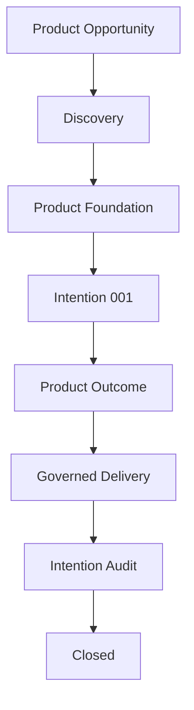

# Example — Inventory Platform

| Field | Value |
|-------|-------|
| Status | Non-normative example |
| Adds rules | No |
| Scope | One product, one Intention |

This is a **teaching example**. It shows what a product looks like when it adopts
the Orivus AI Product Framework — end to end, but deliberately minimal.

It is not a real product and not a reference implementation. It exists only to
make the standard concrete. It is intentionally limited to **a single Intention**
so the shape of the standard is visible without the noise of a full product.

> The standard never depends on a product. This example depends on the standard.

---

## The Product

An imaginary team is building an **Inventory Platform**: a backend that tracks
stock levels across warehouses. We follow it from a product opportunity to one
closed Intention.

---

## The Journey



| Step | What happens | Framework concept |
|------|--------------|-------------------|
| 1 | The team identifies a need: warehouses cannot see real-time stock. | Product Opportunity |
| 2 | They run Discovery to remove uncertainty before building. | [Discovery lifecycle](../../framework/PRODUCT_LIFECYCLE.md) |
| 3 | Discovery produces enough knowledge to build safely. | Product Foundation |
| 4 | The first change is scoped as one Intention with a measurable outcome. | [INTENTION-001.md](INTENTION-001.md) |
| 5 | Milestones are executed one at a time, each verified and audited. | [IMPLEMENTATION_PLAN-001.md](IMPLEMENTATION_PLAN-001.md) |
| 6 | The user-visible capability is confirmed to exist (GR-13). | Product Outcome Realization |
| 7 | A human approves; knowledge is synchronized; the Intention closes. | Human Review + PKS |

---

## Walkthrough

### 1. Product Opportunity

Warehouse operators cannot see current stock without querying a database by hand.
The team wants a real-time view. This is an opportunity, not yet a plan.

### 2. Discovery → Product Foundation

Before writing code, the team establishes:

- **Purpose** — give operators real-time stock visibility.
- **Boundaries** — read-only stock queries; no purchasing, no forecasting.
- **Capabilities** — query stock by warehouse and SKU.
- **Architecture direction** — a small HTTP API over the existing stock store.

That is enough to begin. The product reaches **Foundation**. See
[Product Lifecycle](../../framework/PRODUCT_LIFECYCLE.md).

### 3. One Intention

The first product change is captured as a single governed Intention with a
measurable Product Outcome:

> **[INTENTION-001 — Real-Time Stock Visibility API](INTENTION-001.md)**
>
> Product Outcome: an operator can request current stock for a warehouse and SKU
> over HTTP and receive an accurate, current quantity.

### 4. Governed Delivery

The Intention is planned into a few milestones and executed under the
[Milestone Transaction Protocol](../../specifications/MILESTONE_TRANSACTION_PROTOCOL.md):

```
LOCK → IMPLEMENT → VERIFY → AUDIT → PASS → UPDATE PLAN → NEXT
```

One milestone is open at a time. Each produces evidence before the next begins.
See [IMPLEMENTATION_PLAN-001.md](IMPLEMENTATION_PLAN-001.md).

### 5. Outcome, Audit, Close

- All milestones reach PASS.
- The **Intention Audit** confirms the user-visible outcome exists — an operator
  really can query stock (GR-13). Infrastructure alone would not be enough.
- A human reviews and approves.
- Verified knowledge is synchronized, and the Intention is marked **Closed**.

The product is now ready for its next Intention — with more institutional
knowledge than before.

---

## What This Example Deliberately Omits

- More than one Intention.
- Real source code.
- Product-specific technology choices.

Those belong to real implementations. This example only teaches the shape of the
standard. To see governed execution certified as a framework property, see
[FV-001](../../validation/FV-001-sequential-milestone-loop/README.md).
